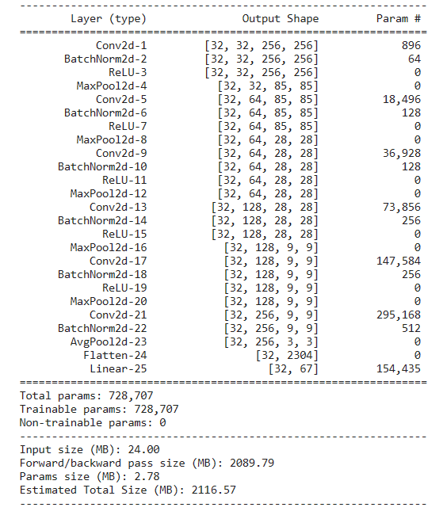
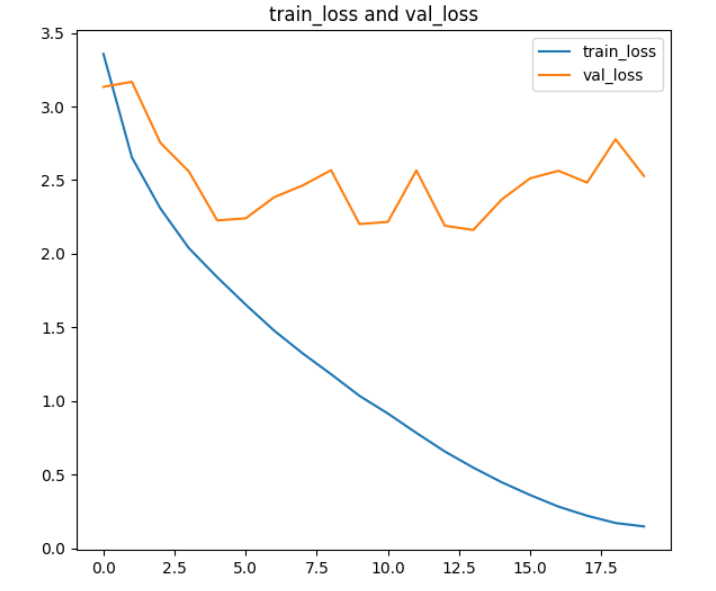
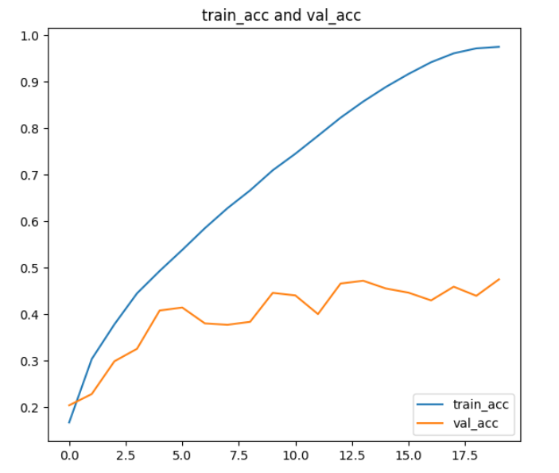

---
CNN卷积神经网络实验过程
---

# 一、实验概况

本次实验是采用MIT的Indoor-scenes-cvpr-2019数据集来作为本次实验的数据集，该数据集总共有15620张图片，67个种类的划分。本次实验内容是基于 torch 搭建 CNN 卷积神经网络来对该数据集进行图像识别分类。

本次实验环境是在 Kaggle 上面完成，使用的 GPU 为 P100 。

# 二、实验步骤

## 1、导入所需的库

```python
import torch 
import torch.nn as nn 
from torchvision import transforms 
import numpy as np 
import matplotlib.pyplot as plt 
import pathlib 
from PIL import Image
from torchvision.datasets import ImageFolder
import random as rd
from torch.utils.data import SubsetRandomSampler, Dataset, DataLoader,random_split
import torch.nn.functional as F
from sklearn.model_selection import train_test_split
from sklearn.model_selection import StratifiedShuffleSplit
import pandas as pd
import torchsummary
import torchvision.models as models
import math
import os
import torch.utils.data.sampler as sampler
plt.rcParams['font.sans-serif'] = ['Arial Unicode MS']  # SimHei 用来正常显示中文标签
plt.rcParams['axes.unicode_minus'] = False  # 用来正常显示负号
# plt.figure(figsize=(15, 10))
# device=torch.device('cpu')
device = torch.device('cuda' if torch.cuda.is_available() else 'cpu')
print(device)
```


## 2、数据处理

首先，本次数据集的读取方式是用 `ImageFolder` 来读取的，这样读取之后的数据会分好class类型和图片对应的便签，这样便于处理。

其次，要对数据集的图像进行预处理，都转成 256*256 像素，并且将数据集按照 0.85: 0.15的比例分成训练集和验证集。

最后，将分好的数据集按照 `BATCH_SIZE = 64` 的参数来加入到加载器中。

```python
IMG_HEIGHT = 256
IMG_WIDTH = 256
BATCH_SIZE = 64
# 图像预处理方法
transform = transforms.Compose([
    transforms.Resize((IMG_HEIGHT, IMG_WIDTH)),  # 高度宽度全部统一为256x256
    transforms.ToTensor(),
])

image_dir = ImageFolder(root ="../input/indoor-scenes-cvpr-2019/
indoorCVPR_09/Images", transform=transform)# 将样本放到这里
# /kaggle/input/indoor-scenes-cvpr-2019/
labels=image_dir.classes
images_labels=image_dir.imgs

np.random.seed(567)
np.random.shuffle(image_dir.imgs)
np.random.seed(42133)
np.random.shuffle(image_dir.imgs)
image_count=len(image_dir)
train_num=int(0.85*image_count)
val_num=image_count-train_num
train_dataset, val_dataset= random_split(image_dir, [train_num,
 val_num], generator=torch.Generator().manual_seed(42))
# 定义数据加载器
train_dataloader = DataLoader(train_dataset, batch_size=BATCH_SIZE, shuffle=True)
val_dataloader = DataLoader(val_dataset, batch_size=BATCH_SIZE, shuffle=True)

imgs, labels_ = next(iter(train_dataloader))
print(imgs.shape)
print(labels_.shape[0])
print(len(train_dataloader))
print("训练集长度", train_num)
print("验证集长度", val_num)
```


## 3、搭建模型

本次实验采用 Cnn 卷积神经网络来进行训练，模型用上了卷积层、激活函数、池化层，并且还用上了归一化处理和平均池化层来提高泛化能力。

模型结构如下：



模型具体代码如下：

```python
class Model(nn.Module):
    def __init__(self):
        super(Model, self).__init__()

        self.cnn = nn.Sequential(
            #3*256*256
            nn.Conv2d(in_channels=3, out_channels=32, kernel_size=3,stride=1,padding=1),
            nn.BatchNorm2d(32),
            nn.ReLU(True),
            nn.MaxPool2d(kernel_size=3),
            #64*64*64
            nn.Conv2d(in_channels=32, out_channels=64, kernel_size=3, stride=1, padding=1),
            nn.BatchNorm2d(64),
            nn.ReLU(True) ,
            nn.MaxPool2d(kernel_size=3),
            #64*16*16
    nn.Conv2d(in_channels=64,out_channels=64,kernel_size=3,stride=1,padding=1),
            nn.BatchNorm2d(64),
            nn.ReLU(True),
            nn.MaxPool2d(kernel_size=1),
            nn.Conv2d(in_channels=64, out_channels=128,kernel_size=3,stride=1,padding=1),
            nn.BatchNorm2d(128),
            nn.ReLU(True),
            nn.MaxPool2d(kernel_size=3),
            nn.Conv2d(in_channels=128, out_channels=128,kernel_size=3,stride=1,padding=1),
            nn.BatchNorm2d(128),
            nn.ReLU(True),
            nn.MaxPool2d(kernel_size=1),
            nn.Conv2d(in_channels=128, out_channels=256, kernel_size=3, stride=1,padding=1),
            nn.BatchNorm2d(256),
            nn.AvgPool2d(3),
            nn.Flatten(),
            nn.Linear(in_features=256*3*3, out_features=500),
            nn.ReLU(True),
            nn.Linear(in_features=500, out_features=67),
        )

    def forward(self, x):
        x = self.cnn(x)
        return x
```

## 4、训练函数和验证函数

训练函数如下：

```python
loss_fn = torch.nn.CrossEntropyLoss() 
optimizer = torch.optim.Adam(model.parameters(), lr=LEARNING_RATE)
def train(dataloader, model, loss_fn, optimizer):
    size=len(dataloader.dataset)
    train_acc=0
    train_loss=0
    cnt=0
    num_batches=len(dataloader)
    for X,y in dataloader:
        X = X.to(device)
        y = y.to(device)
        optimizer.zero_grad()
        output = model(X)
        _, pred = torch.max(output,1)
        loss = loss_fn(output,y)
        loss.backward()
        optimizer.step()
        train_loss+=loss.item()*X.size(0)
        train_acc += torch.sum(pred == y.data)
        print(f"\r{cnt/num_batches*100:.2f}%", end="", flush=True)
        cnt += 1
    train_acc= train_acc.double() /size
    train_loss= train_loss /len(dataloader.dataset)
    return train_acc , train_loss
```

验证函数如下：

```python
def val(dataloader, model, loss_fn):
    size = len(dataloader.dataset)  # 测试集的大小
    num_batches = len(dataloader)  # 批次数目
    val_loss, val_acc = 0, 0
    # 当不进行训练时，停止梯度更新，节省计算内存消耗
    with torch.no_grad():
        for imgs, target in dataloader:
            imgs, target = imgs.to(device), target.to(device)
            # 计算loss
            target_pred = model(imgs)
            _, targets_pred = torch.max(target_pred,1)
            # loss = loss_fn(target_pred, target.squeeze().float())
            loss = loss_fn(target_pred, target)
            val_loss+=loss.item()*imgs.size(0)
            val_acc += torch.sum(targets_pred == target.data)
    val_acc= val_acc.double() /size
    val_loss= val_loss /len(dataloader.dataset)
    return val_acc, val_loss
```


## 5、参数设置和迭代函数

初始化模型，然后在参数设置上，`BATCH_SIZE = 64`，迭代次数设置为 20 次，超学习率设置为 1.1408e-4 。

```python
model = Model().to(device)
# 查看网络结构
torchsummary.summary(model, (3, IMG_HEIGHT, IMG_HEIGHT), batch_size=BATCH_SIZE)
LEARNING_RATE = 1.11408e-4 # 学习率 超参数，可调整
EPOCHS = 20
```

然后，设计迭代函数，并且初始化多个数组来记录训练集和验证集的准确度和损失值，便于用来图像展示。

```python
train_loss_lt = []
train_acc_lt = []
val_loss_lt = []
val_acc_lt = []
for epoch in range(EPOCHS):
    model.train()
    epoch_train_acc, epoch_train_loss = train(train_dataloader, model, loss_fn, optimizer)
    model.eval()
    epoch_val_acc, epoch_val_loss = val(val_dataloader, model, loss_fn)

    train_acc_lt.append(epoch_train_acc)
    train_loss_lt.append(epoch_train_loss)
    val_acc_lt.append(epoch_val_acc)
    val_loss_lt.append(epoch_val_loss)

    template = '\rEpoch:{:2d}, Train_acc:{:.1f}%, Train_loss:{:.3f}, 
    Test_acc:{:.1f}%，Test_loss:{:.3f}'
    print(template.format(epoch + 1, epoch_train_acc * 100,
     epoch_train_loss, epoch_val_acc * 100, epoch_val_loss))
print('训练完毕！')
```

## 6、可视化的实现

```python
# 可视化
epochs_range = range(EPOCHS)
plt.rcParams['font.sans-serif'] = ['SimHei']  # SimHei 用来正常显示中文标签
plt.rcParams['axes.unicode_minus'] = False  # 用来正常显示负号

plt.figure(figsize=(15, 6))
plt.subplot(1, 2, 1)
train_acc=[]
val_acc=[]
for a in train_acc_lt:
    train_acc.append(a.cpu().numpy())
for a in val_acc_lt:
    val_acc.append(a.cpu().numpy())

plt.plot(epochs_range, train_acc, label='train_acc')
plt.plot(epochs_range, val_acc, label='val_acc')
plt.legend(loc='lower right')
plt.title('train_acc and val_acc ')
plt.subplot(1, 2, 2)
plt.plot(epochs_range, train_loss_lt, label='train_loss')
plt.plot(epochs_range, val_loss_lt, label='val_loss')
plt.legend(loc='upper right')
plt.title('train_loss and val_loss')
plt.show()

# 保存模型
torch.save(model, "21_model")
```


# 三、实验结果




